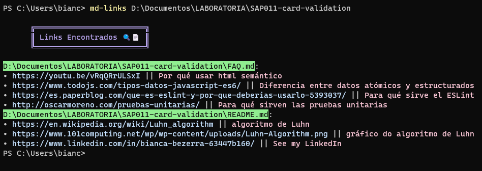
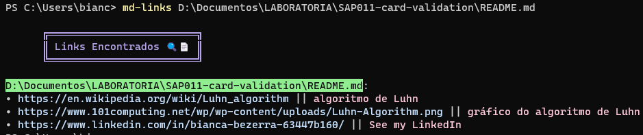
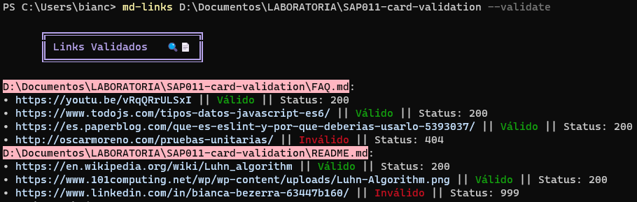
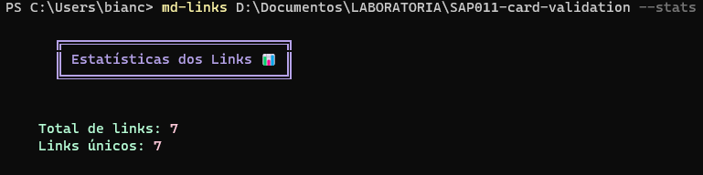
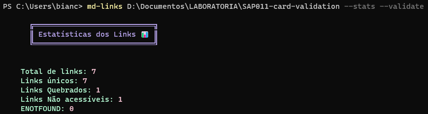
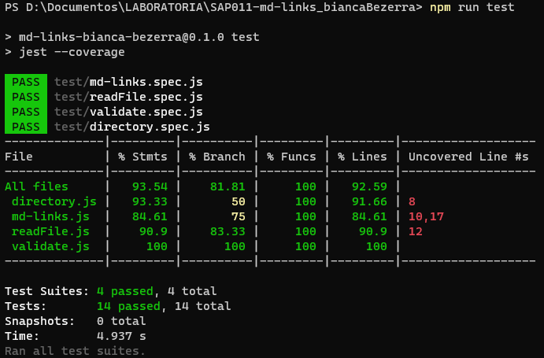

# Markdown Links 🤖

## Índice

- [1. Prefácio](#1-prefácio)
- [2. Resumo do projeto](#2-resumo-do-projeto)
- [3. Primeiros passos](#3-primeiros-passos)
- [4. Tecnologias](#4-tecnologias-utilizadas)
- [5. Critérios de aceitação](#5-critérios-de-aceitação)
- [6. Testes Unitários](#6-testes-unitarios)
- [7. Desenvolvedor](#7-desenvolvedor)

---

## 1. Prefácio

No cenário em constante evolução do desenvolvimento web e gerenciamento de conteúdo, o [Markdown](https://pt.wikipedia.org/wiki/Markdown) emergiu como uma escolha popular para a criação de documentação estruturada e de fácil leitura. É uma linguagem de marcação leve que permite aos escritores se concentrarem no conteúdo, tornando-a uma excelente escolha para criar arquivos README, documentação e outros conteúdos textuais dentro de um projeto. No entanto, à medida que os projetos crescem, aumenta também a complexidade de gerenciamento e validação dos links contidos nos arquivos Markdown. É aí que entra o md-links.


## 2. Resumo do projeto

Md-links é uma biblioteca Javascript que simplifica o processo de extração de links de arquivos Markdowne também a leitura de diretórios, validando-os e fornecendo estatísticas valiosas sobre os links. Ele foi projetado para ser facilmente instalável por meio do npm, tornando-o acessível aos desenvolvedores.

**Principais Características:**

- Extração de link: md-links pode verificar com eficiência arquivos Markdown e extrair todos os links dentro deles, anulando a morosidade do processo manual.

- Validação de link: vai um passo além ao validar esses links para garantir que estejam ativos.

- Geração de estatísticas: md-links fornece estatísticas detalhadas sobre os links encontrados nos arquivos.

## 3. Primeiros passos

```
npm install md-links-bianca-bezerra
```

- Para extrair links de um arquivo Markdown em um diretório, execute:

```
md-links <nomedodiretorio>
```



- Para extrair links de um arquivo Markdown, execute:

```
md-links nomedodiretorio/nomedoarquivo.md
```


- Para validar links de um arquivo Markdown, execute:
```
md-links nomedodiretorio/nomedoarquivo.md --validate
```


- Para obter estatísticas de links de um arquivo Markdown, execute:
```
md-links nomedodiretorio/nomedoarquivo.md --stats
```


- Para obter estatísticas e validar links de um arquivo Markdown, execute:
```
md-links nomedodiretorio/nomedoarquivo.md --stats --validate
```



## 4. Tecnologias utilizadas

- Node.js/Javascript
- CLI (interface de linha de comando)
- File System
- Axios
- Path
- Chalk
- Assert
- Sinon

## 5. Critérios de aceitação

[✔] Instalável via ``` npm ```

[✔] Executável via interface de linha de comando

[✔] Opções para o usuário validar e obter estatísticas sobre links em um diretório

[✔] Opções para o usuário validar e obter estatísticas sobre links de um arquivo

[✔] O usuário pode visualizar os links quebrados

[✔] Testes unitários cobrem um mínimo de 70% de statements, functions, lines e branches.

[✔] Package.json: deve possuir nome, versão, descrição, autor, licença, dependências e scripts (pretest, test e etc).

## 6. Testes Unitários

Este projeto conta com uma `suíte completa de testes unitários` para garantir a qualidade do código e a confiabilidade da ferramenta de linha de comando. Os testes foram escritos utilizando a biblioteca de testes Jest e Sinon.

Os testes unitários cobriram a porcentagem mínima permitida de statements, functions lines e branches.



## 7. Desenvolvedor

**Bianca Bezerra**
- No github: [@biancaBezerra](https://github.com/biancaBezerra)
- No Linkedin: [@biancaBezerra](https://www.linkedin.com/in/bianca-bezerra-63447b160/)